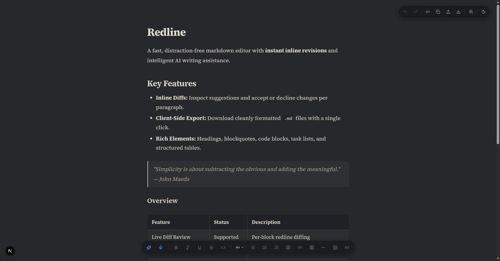
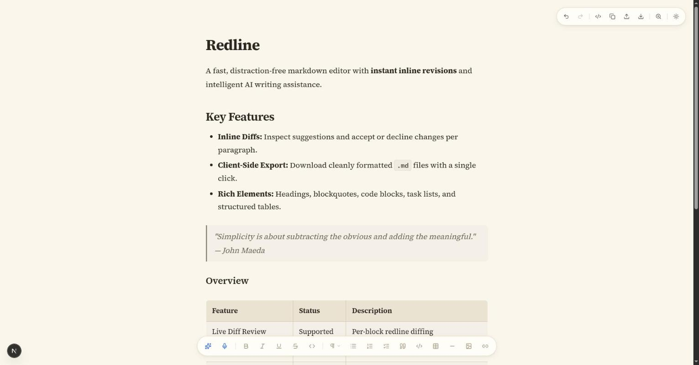
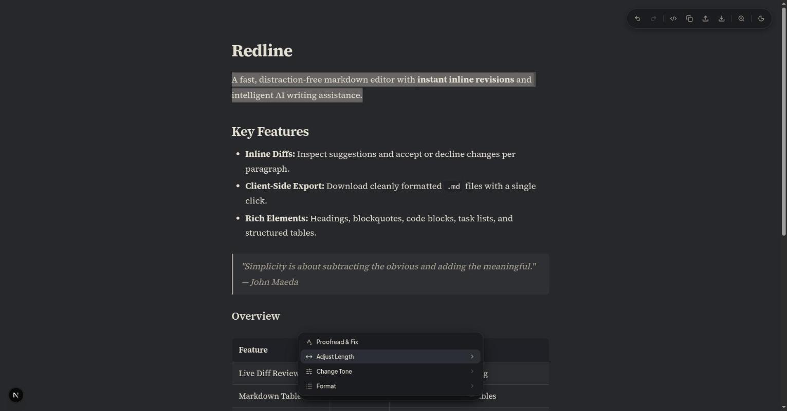
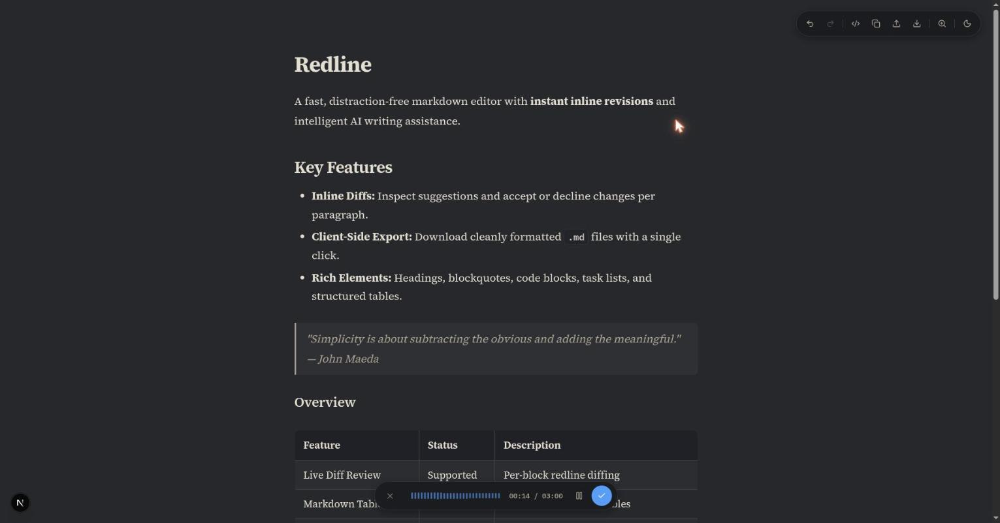
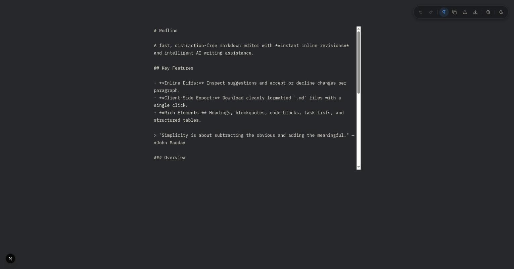

# Redline

Redline is a minimalist, distraction-free Markdown editor featuring in-place AI writing assistance and inline redline diff reviews. Instead of replacing text wholesale or requiring external chat windows, Redline lets you review AI edits directly within your document using visual diff highlights and granular accept or reject controls.

<p align="center">
  
  
</p>
<p align="center">
  
  
  
</p>

---

## Features

* **Inline Redline Diffs:** Inspect additions and deletions visually before committing them. Accept or reject changes per block or in bulk.
* **ProseMirror & TipTap Core:** Rich-text editing with bidirectional Markdown synchronization, tables, task lists, code blocks, blockquotes, links, and images.
* **AI Transformation Modes:**
  * **Presets:** Proofread and fix, shorten, expand, summarize, tone adjustment, and markdown formatting.
  * **Custom Instructions:** Custom prompts for in-place text replacement or generation from scratch.
* **Voice Transcription:** In-memory audio recording with live waveform visualizer, pause/resume support, and direct transcription insertion via OpenAI's `gpt-4o-mini-transcribe` model.
* **Interactive Controls:** Floating morphing dock powered by Framer Motion, keyboard-driven preset navigation, and raw Markdown source view toggle.
* **Theme & Customization:** Multiple color themes (Dark, Charcoal, Nord, Sepia, High Contrast, Light) and viewport zoom controls (75% to 150%).

---

## Tech Stack

* **Framework:** Next.js (App Router), React 19, TypeScript
* **Rich Text:** TipTap v3, ProseMirror, tiptap-markdown
* **AI Integration:** Vercel AI SDK (`ai`), `@ai-sdk/openai`
* **Animations & UI:** Framer Motion, CSS Modules, Lucide Icons, Sonner

---

## Getting Started

### Prerequisites

* Node.js 18+ or later
* npm, pnpm, or yarn
* An OpenAI API Key

### Installation

1. Clone the repository:
   ```bash
   git clone https://github.com/muhaimanalishah/redline.git
   cd redline
   ```

2. Install dependencies:
   ```bash
   npm install
   ```

3. Configure environment variables:
   Create a `.env.local` file in the root directory:
   ```env
   OPENAI_API_KEY=your_openai_api_key_here
   OPENAI_MODEL=gpt-4o-mini
   OPENAI_TRANSCRIPTION_MODEL=gpt-4o-mini-transcribe
   ```

4. Run the development server:
   ```bash
   npm run dev
   ```

   Open [http://localhost:3000](http://localhost:3000) in your browser.

---

## Scripts

* `npm run dev`: Starts the Next.js development server.
* `npm run build`: Builds the application for production.
* `npm run start`: Starts the production build.
* `npm run lint`: Runs ESLint checks.

---

## License

MIT
